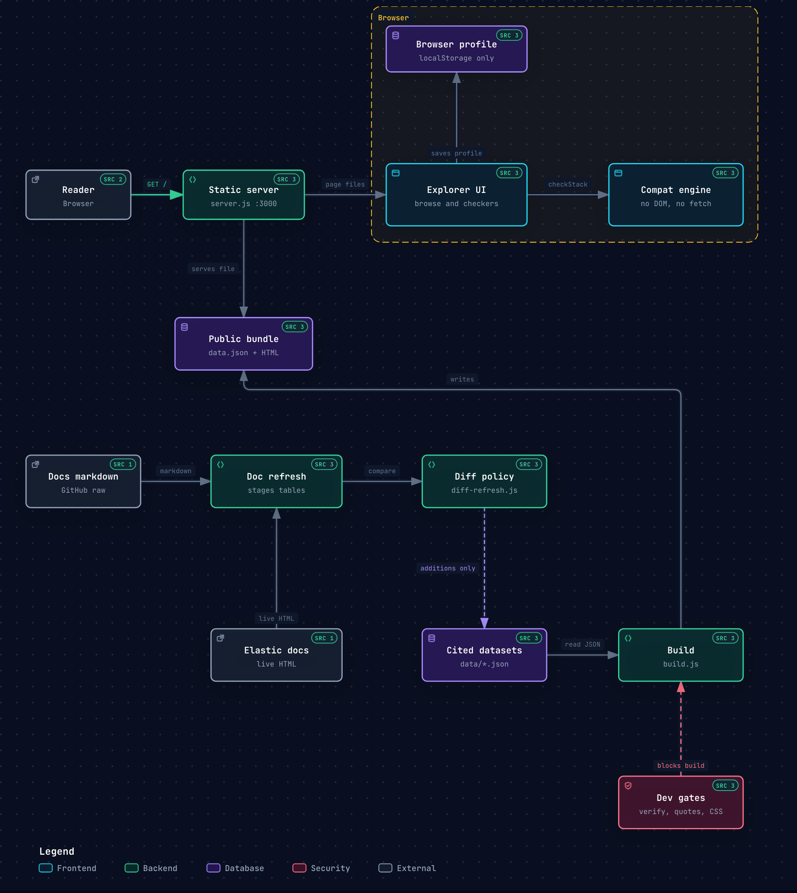

# Elastic APM · EDOT · Synthetics — Compatibility & Support Matrix

> Repo: [`e-parth-pathak/apm-edot-supportability`](https://github.com/e-parth-pathak/apm-edot-supportability)

An interactive Node.js app that consolidates Elastic's compatibility and support
matrices into one searchable, filterable UI with light/dark mode — plus three checkers
that take your setup and tell you where the holes are, with a doc citation for every
verdict.

**Every value in the UI is a verbatim transcription of an Elastic documentation page,
and every table row links back to the exact page and anchor it came from.** Nothing is
inferred, computed, or paraphrased into a compatibility claim. Where the docs state
something in prose rather than a table, the prose is reproduced as-is.

## Architecture

[`docs/architecture.html`](docs/architecture.html) is the interactive diagram. Open that file in a browser. The picture below is the same diagram.



A reader opens the static server, which serves the browse and check UI. Checker inputs, theme, and mode stay in `localStorage`. `engine.js` runs in the page: each finding copies `quote` and `sourceUrl` from `rules.json`, and a combination the docs do not state stays `not-documented`. `build.js` writes `public/data.json` and inlines that bundle into `standalone.html` and `artifact.html`. Refresh parses GitHub markdown, cross-checks those cells against the live Elastic HTML, and stages the tables. It does not write `data/`. `diff-refresh.js` appends added rows only when run with `--apply-additions`. Cell changes and deletions stay for review. In `dev.js`, `verify.js`, `check-quotes.js`, and `check-css.js` skip the build when they fail.

## Requirements

Node ≥ 18. **No dependencies** — `npm install` isn't needed and does nothing. Everything
uses Node built-ins (`http`, `fs`, `path`, `child_process`).

## Quick start

```bash
git clone https://github.com/e-parth-pathak/apm-edot-supportability.git
cd apm-edot-supportability
npm run dev          # → http://localhost:3000
```

The build outputs (`public/data.json`, `public/standalone.html`, `public/artifact.html`)
are gitignored and regenerated on first run, so a fresh clone has no stale data.

## Dev

```bash
npm run dev          # or: node dev.js
```

Then open <http://localhost:3000>. `dev.js` verifies, builds, starts the server, and
watches for changes:

- edit any `data/*.json` → re-verifies and rebuilds, then reload the browser
- edit any hand-edited file in `public/` → **just reload**; `index.html` loads them
  directly, so a rebuild is only needed to refresh `standalone.html` / `artifact.html`
- if any gate fails, the build is skipped and the last good bundle keeps serving — fix
  it and save again

It does not watch the generated files (`data.json`, `standalone.html`, `artifact.html`);
that would loop. Set `PORT` to change the port: `PORT=8080 npm run dev`.

## Production / one-off

```bash
npm start            # node build.js && node server.js
```

Individually:

| Command | Does |
| --- | --- |
| `npm run verify` | Citation checks, rule-quote grounding, CSS cascade guard, freshness gate. |
| `npm run build` | `data/*.json` → `public/data.json`, `public/standalone.html`, `public/artifact.html` |
| `npm run test` | build + engine + UI + refresh tests |
| `npm run check` | Everything: all six gates + build + all three test suites. **Use this in CI.** |
| `npm run serve` | Serves `public/` on `:3000` without rebuilding |
| `npm run refresh` | Re-pull from Elastic docs and report the diff. Writes nothing to `data/`. |
| `npm run refresh:apply` | Same, but auto-applies row additions. |
| `npm run refresh:paths` | List repo trees to fix a moved markdown path. |
| `npm run freshness` | How old is the committed data? |
| `npm run dev` | all gates + build + serve + watch |

`npm run check` is the full gate. `build.js` also runs its own integrity pass and exits
non-zero if any section or rule lost its citation, so `npm run build` alone is a usable
minimum.

### Build outputs

| File | Use |
| --- | --- |
| `public/data.json` | Fetched by `index.html` at runtime; also served at `/api/data` |
| `public/standalone.html` | Single self-contained file (data + CSS + JS inlined). Open via `file://` or drop on any static host. First load follows `prefers-color-scheme`. |
| `public/artifact.html` | Same, but defaults to light on first load for embedding in a light-mode host UI. Toggle still works. |

## Two modes

**Browse matrices** — the searchable reference view over all 47 matrices.

**Check my setup** — three interactive checkers that take your details and find the holes:

1. **My stack** — Stack version, Elastic Agent version, ingestion path, EDOT SDKs, classic
   APM agents, OS/platform, `service.name`, plus flags for cumulative histograms, exemplars
   and managed Kubernetes. Returns a verdict per component.
2. **Migration gaps** — tick the capabilities you use on classic APM today; get back what
   has no EDOT equivalent, what needs rework, and what migrates cleanly.
3. **Feature by language** — pick required features; get the EDOT SDKs that have them all,
   at which version, and why the others don't qualify.

Inputs persist in `localStorage` only. Nothing is sent anywhere — the whole engine runs
client-side off the bundled data.

## Verify the citations

```bash
npm run check      # all six gates + build + all three test suites
```

Six independent gates, each of which fails the build:

| Gate | Asserts |
| --- | --- |
| `node verify.js` | Every rendered section has a `sourceUrl`; row/column counts match; all URLs well-formed and on an allow-listed host; no non-`http(s)` inline links. |
| `node check-quotes.js` | **Every rule's `quote` appears verbatim in the scraped dataset it names.** A rule cannot cite text that isn't in the docs we actually read. |
| `node check-css.js` | Every element toggled via the `hidden` attribute is actually un-paintable — i.e. no author `display` rule can override it. See below. |
| `node check-freshness.js` | Data age against the thresholds in `sources.json`. Warns past 45 days, fails past 120. |
| `node test-engine.js` | 94 assertions: version banding, per-checker verdicts against known doc facts, and the invariant that *every* finding carries a `sourceUrl` and evidence. |
| `node test-ui.js` | 53 assertions driving the real page in jsdom: both modes, all three forms, and that every finding rendered to a user has a doc link. |
| `node test-refresh.js` | 74 assertions on the refresh pipeline against offline fixtures: markdown parsing, cross-check, and every branch of the additions-auto / changes-review policy. |

Current results:

```
verify        files 18 | sections 148 | with sourceUrl 148 (100%) | rows 281 | errors 0
check-quotes  rules 40 | quotes checked 48 | undocumented cases 7 | errors 0
check-css     toggled elements checked 5 | errors 0
check-freshness  age within the 45-day window
test-engine   94 passed, 0 failed
test-ui       53 passed, 0 failed
test-refresh  74 passed, 0 failed
```

### Why there's a separate CSS gate

The browse view is `<div class="layout" hidden>`. The UA stylesheet has
`[hidden] { display: none }`, but `.layout { display: grid }` is an *author* rule, so it
wins — setting `.hidden = true` in JS left all 18 support-matrix cards rendered above the
checker form. Real bug, shipped briefly.

A DOM test cannot catch it. jsdom's `getComputedStyle` returns `"none"` for `[hidden]`
regardless of competing author rules, so the page tests reported everything as correct
while a browser showed the matrices. Verified directly:

```js
new JSDOM('<div class="layout" hidden></div><style>.layout{display:grid}</style>')
// getComputedStyle(...).display === "none"   // wrong — a browser says "grid"
```

So `check-css.js` reads the stylesheet as text: it finds every element `app.js` toggles via
`.hidden`, looks up the classes on that element in `index.html`, and fails if any class
declares a `display` that isn't neutralised by a global
`[hidden] { display: none !important }`. Removing the fix makes it fail by name
(`#browse-view (.layout) sets display and would beat [hidden]`).

`test-ui.js` now asserts only that the hidden *attribute* lands on the right containers,
with a comment pointing here — the paint question is deliberately out of its scope.

`test-ui.js` needs jsdom, which is deliberately **not** a saved dependency — the app itself
has none. Install it only when you want to run UI tests: `npm i --no-save jsdom`. Without
it the test skips cleanly rather than failing.

## Keeping the data fresh

Elastic's docs change. The project treats staleness as a first-class, visible fact rather
than something you discover when a verdict turns out to be wrong.

```bash
npm run refresh              # fetch + diff, report only (nothing written to data/)
npm run refresh:apply        # fetch + diff, auto-apply row ADDITIONS only
npm run refresh:paths        # list repo trees to fix a moved markdown path
npm run freshness            # how old is the committed data?
```

### How the refresh works

Two sources, cross-checked against each other:

1. **Markdown is the parse source.** Each page's `.md` lives in `elastic/docs-content` or
   `elastic/opentelemetry` — the "Edit this page" target. Tables parse cleanly with no site
   boilerplate.
2. **The rendered page is the cross-check.** Every non-trivial cell parsed from markdown
   must also appear in the live HTML. Anything present in one but not the other is reported
   as a conflict and never auto-applied — markdown can be ahead of what's published.

`data/sources.json` maps every dataset to both. **It is the only file to edit when Elastic
moves a page.** Each entry carries a `verified` field recording how much to trust its
markdown path:

| `verified` | Meaning |
| --- | --- |
| `scrape-2026-09-09` | Path read directly off the page's "Edit this page" link. High confidence. **7 of 26.** |
| `inferred-from-sibling` | Follows the same directory convention as a sibling whose path *was* observed. Likely right. |
| `unverified-guess` | The URL slug may not match the repo directory (e.g. `/edot-sdks/node` vs `docs/reference/edot-sdks/nodejs/`). |

`npm run refresh:paths` lists the actual repo trees and prints candidate paths for anything
that 404s, so fixing a moved page is a copy-paste rather than a hunt.

### What gets applied automatically, and what doesn't

| Change | Policy | Why |
| --- | --- | --- |
| Row **added** | auto-applicable | A new row can't invalidate an existing citation; it only extends a table. |
| Cell **changed** | **review** | A changed cell can silently flip a verdict the checkers report. |
| Row **removed** | **review** | Could mean Elastic dropped support, or the parse broke. Indistinguishable. |
| Columns changed | **review** | Reshapes every row; row-diffing against different columns is meaningless. |
| New table appears | **review** | Needs a heading, a source anchor and a decision about where it belongs. |
| Ambiguous rows | **review** | If rows share an identifying key, the diff escalates rather than guess. |

`diff-refresh.js` exits non-zero whenever review is needed, so CI blocks on it.

### The bit that matters most: rule quotes at risk

Every rule in `data/rules.json` quotes a doc sentence verbatim. If a refresh changes a
sentence a rule quotes, that rule silently loses its grounding. `diff-refresh.js` predicts
this **before** anything is applied and names the affected rules:

```
RULE QUOTES AT RISK (1)
  path-apm-server-otel  (dataset: edot-sdks-compat)
    quote  : Telemetry might ingest but mapping, enrichment, and troubleshooting are not guaranteed.
    changed: This path is now fully supported.
```

When you see that, the fix is to update the rule's `quote` **and** re-check whether its
`verdict` is still what the doc says — a reworded sentence often means the support level
itself changed. Then `npm run check`.

### Staleness is visible in three places

- **The UI banner** — grey inside the window, amber past `maxAgeDays` (45), red past
  `maxAgeDaysHardFail` (120), with wording that tells the reader to follow the source link
  rather than trust the page. Shown in both modes.
- **`check-freshness.js`** — a build gate. Warns past the soft limit, fails past the hard
  one. `--strict` fails at the soft limit.
- **A weekly CI job** (`.github/workflows/refresh-drift.yml`) — runs the refresh Mondays
  07:00 UTC, uploads the diff, and opens/updates a single `data-drift` issue. Report-only;
  it never pushes to `main`.

### Verification caveat — read this before the first real run

**The network paths in `refresh.js` have never been executed.** The environment this was
built in could not reach `elastic.co` or `raw.githubusercontent.com`, so I could not run a
live fetch end to end. What *is* tested, by `test-refresh.js` against recorded fixtures
(74 assertions):

- markdown table parsing, including both anchor syntaxes, code fences, escaped pipes,
  inline code, short rows and malformed separators
- markdown→text and HTML→text normalisation
- the cross-check, both when cells match and when they don't
- every branch of the diff policy above, including `--apply-additions` actually writing
- the rule-quote-at-risk prediction

Untested in anger: the actual HTTP calls, and whether the 19 `inferred-from-sibling` /
`unverified-guess` markdown paths resolve. `refresh.js` is built to fail loudly and write
nothing when it can't fetch — verified: with no network it exits 2 and leaves `data/`
byte-identical. **Treat the first live run as needing a human eye**, and start with
`npm run refresh:paths` to confirm the paths before trusting a diff.

## How the checkers avoid guessing

The engine holds no compatibility knowledge. Everything lives in `data/rules.json`, where
each rule carries the doc sentence that justifies it:

```json
{
  "id": "path-apm-server-otel",
  "kind": "ingestion-path",
  "verdict": "not-supported",
  "headline": "EDOT SDKs sending directly to APM Server's OTel intake is not supported",
  "quote": "Telemetry might ingest but mapping, enrichment, and troubleshooting are not guaranteed.",
  "sourceUrl": "https://www.elastic.co/.../compatibility/sdks#support-matrix-for-edot-sdk-ingestion",
  "datasetId": "edot-sdks-compat",
  "remedy": "…", "remedyQuote": "…", "remedySourceUrl": "…"
}
```

`rules.json` also has an `undocumented` block — combinations the engine **refuses** to
judge, each with the reason and a doc link. These surface in the UI as *Not documented*
rather than a verdict. There are 7:

| Case | Why no verdict |
| --- | --- |
| EDOT Browser vs Agent version | Browser is absent from the "applies to all EDOT SDKs" list on the SDKs page |
| Android version support | The Android supported-technologies page returned an empty body; no version table exists |
| EDOT Java version tables | Java delegates to upstream OTel Java Instrumentation; version ranges live in that repo |
| Elastic Agent 8.x vs Stack | Only Agent 9.x has a published compatibility table |
| Classic agent vs Stack version | Classic agents are versioned against the *APM integration*, not the Stack |
| Histogram temporality on APM Server intake | Documented for Managed OTLP and the Collector ES exporter only |
| Synthetics vs EDOT | The Synthetics matrix makes no statement about EDOT or OTLP |

That last one is worth knowing about: a ticked input that matches no documented rule is
reported as *Not documented* rather than silently dropped, because silence reads as
"you're fine" — which is exactly the wrong message for an undocumented combination.

## UI

| Feature | Notes |
| --- | --- |
| Light / dark mode | Toggle in the header. Persists in `localStorage`; first visit follows `prefers-color-scheme`. |
| Global filter | Searches every table cell, column header, list item, section note and prose block. Press `/` to focus, `Esc` to blur. |
| Status filter | Supported / GA · Tech preview · Not supported · Incompatible / Not available. Applies to the matrix tables. |
| Per-row citation | Every table row ends in a `docs ↗` link to the exact source anchor. |
| Section citation | Every section header has a **Source doc** pill. |
| Legend | The EDOT SDK feature matrix renders Elastic's own ✅ / 𝐓 / ➖ / ❌ legend, with a link to it. |
| Footer | Lists all 26 source pages plus the scrape timestamp. |

## Sources scraped (26 pages)

**Classic APM**
- [APM agent compatibility](https://www.elastic.co/docs/solutions/observability/apm/apm-agent-compatibility)

**EDOT / OpenTelemetry compatibility** (the landing page and all 7 sub-pages)
- [Compatibility and support (index)](https://www.elastic.co/docs/reference/opentelemetry/compatibility/index.html)
- [Features](https://www.elastic.co/docs/reference/opentelemetry/compatibility/features)
- [Collectors](https://www.elastic.co/docs/reference/opentelemetry/compatibility/collectors)
- [SDKs](https://www.elastic.co/docs/reference/opentelemetry/compatibility/sdks)
- [Elastic OpenTelemetry compared to upstream](https://www.elastic.co/docs/reference/opentelemetry/compatibility/edot-vs-upstream)
- [Limitations](https://www.elastic.co/docs/reference/opentelemetry/compatibility/limitations)
- [Nomenclature](https://www.elastic.co/docs/reference/opentelemetry/compatibility/nomenclature)
- [Data streams comparison](https://www.elastic.co/docs/reference/opentelemetry/compatibility/data-streams)

**EDOT SDKs** (overview plus each language page and its supported-technologies page)
- [EDOT SDKs overview](https://www.elastic.co/docs/reference/opentelemetry/edot-sdks)
- [.NET](https://www.elastic.co/docs/reference/opentelemetry/edot-sdks/dotnet) · [supported technologies](https://www.elastic.co/docs/reference/opentelemetry/edot-sdks/dotnet/supported-technologies)
- [Java](https://www.elastic.co/docs/reference/opentelemetry/edot-sdks/java) · [supported technologies](https://www.elastic.co/docs/reference/opentelemetry/edot-sdks/java/supported-technologies)
- [Node.js](https://www.elastic.co/docs/reference/opentelemetry/edot-sdks/node) · [supported technologies](https://www.elastic.co/docs/reference/opentelemetry/edot-sdks/node/supported-technologies)
- [PHP](https://www.elastic.co/docs/reference/opentelemetry/edot-sdks/php) · [supported technologies](https://www.elastic.co/docs/reference/opentelemetry/edot-sdks/php/supported-technologies)
- [Python](https://www.elastic.co/docs/reference/opentelemetry/edot-sdks/python) · [supported technologies](https://www.elastic.co/docs/reference/opentelemetry/edot-sdks/python/supported-technologies)
- [Android](https://www.elastic.co/docs/reference/opentelemetry/edot-sdks/android) · [automatic instrumentation](https://www.elastic.co/docs/reference/opentelemetry/edot-sdks/android/automatic-instrumentation)
- [iOS](https://www.elastic.co/docs/reference/opentelemetry/edot-sdks/ios) · [automatic instrumentation](https://www.elastic.co/docs/reference/opentelemetry/edot-sdks/ios/automatic-instrumentation)
- [Browser](https://www.elastic.co/docs/reference/opentelemetry/edot-sdks/browser) · [supported technologies](https://www.elastic.co/docs/reference/opentelemetry/edot-sdks/browser/supported-technologies)

**Synthetics**
- [Synthetics support matrix](https://www.elastic.co/docs/solutions/observability/synthetics/support-matrix)

## Things worth knowing about the data

These are stated plainly in the UI too, but they're the places where "there is no table"
is the honest answer:

1. **`.../edot-sdks/android/supported-technologies` returned an empty body.** The Android
   instrumentation data therefore comes from
   [`.../android/automatic-instrumentation`](https://www.elastic.co/docs/reference/opentelemetry/edot-sdks/android/automatic-instrumentation).
   Neither Android page publishes a version/API-level compatibility table, so none is shown.
   This is recorded in `data/sdk-android.json` as `scrapeNote` and rendered in the UI.
2. **EDOT Java publishes no version tables of its own.** Its supported-technologies page
   delegates to upstream OpenTelemetry Java Instrumentation ("supports JVM (OpenJDK, OpenJ9)
   versions 8+", "all the application servers documented by the OpenTelemetry Java agent").
   The prose is reproduced verbatim with links out, rather than inventing a table.
3. **Combined views are labelled.** The "All APM agents" and "Synthetics components" tables
   are stitched together from the per-agent / per-component sections of a single source page,
   purely for at-a-glance reading. Each says so in its notes, and the original per-section
   tables are rendered below it unmodified.
4. **Footnote markers are preserved as superscripts** (`Compatible⁴`, `Host view¹`,
   `✅ 1.0+¹`) with the footnote text in the section notes, matching the source pages.
5. **Status colouring is presentational only.** It is keyed off the exact status words
   Elastic uses (`Supported`, `Not supported`, `Compatible`, `Incompatible`, `Yes`, `No`,
   ✅ / 𝐓 / ➖ / ❌). No cell's meaning is changed, and the raw text is always shown.

## Layout

```
apm-edot-compatibility-matrix/
├── package.json
├── docs/
│   ├── architecture.html  interactive architecture diagram
│   └── architecture.png   still of that diagram, shown above
├── dev.js                 verify + grounding + CSS guard + build + serve + watch
├── build.js               data/*.json -> public/{data.json,standalone.html,artifact.html}
├── server.js              zero-dependency static server + /api/data
├── verify.js              citation & integrity checks on the datasets
├── check-quotes.js        grounds every rule quote against the scraped data
├── check-css.js           guards the hidden-attribute cascade (see above)
├── check-freshness.js     data-age build gate
├── refresh.js             cross-checked re-pull from Elastic docs
├── diff-refresh.js        staged-vs-committed diff + apply policy
├── test-refresh.js        74 tests for the refresh pipeline (offline fixtures)
├── test-engine.js         94 unit tests for the evaluator
├── test-ui.js             53 tests driving the real page in jsdom
├── data/
│   ├── rules.json         the cited rules engine  (40 rules, 7 undocumented cases)
│   ├── sources.json       page -> markdown source manifest (edit when a page moves)
│   ├── freshness.json     when the data was last refreshed, and how
│   └── *.json             18 scraped datasets, one per doc page (or per language)
└── public/
    ├── index.html         hand-edited
    ├── styles.css         hand-edited — light/dark theme tokens
    ├── engine.js          hand-edited — pure evaluator, no DOM (also used by tests)
    ├── checkers.js        hand-edited — the three forms + finding cards
    ├── app.js             hand-edited — browse view, search, filters, theme, modes
    ├── data.json          GENERATED
    ├── standalone.html    GENERATED — single-file build
    └── artifact.html      GENERATED — single-file build, light-default
```

Sources are `data/*.json` and the five hand-edited files in `public/`. The three
`GENERATED` files are rewritten on every build — don't edit them.

`engine.js` is deliberately DOM-free and dual-exports (browser global + CommonJS), so
`test-engine.js` exercises byte-for-byte the same code the page runs.

### Adding a rule

1. Add it to `data/rules.json` with a `quote`, `sourceUrl` and `datasetId`.
2. The quote must appear **verbatim** in that dataset. If the sentence you want to cite
   isn't in `data/*.json` yet, transcribe it into the relevant dataset's `notes` first —
   don't reword the quote to fit.
3. `npm run check`. `check-quotes.js` will tell you if the quote isn't grounded.

Step 2 is the load-bearing one: it's what stops a rule from citing a sentence that sounds
right but isn't actually on the page. It already caught one during development.

### Refreshing the data

The doc pages change. To refresh, re-read the source pages and edit the matching
`data/*.json` file, keeping the schema:

```json
{
  "id": "…", "language": "…",
  "sources": [{ "title": "…", "url": "https://…" }],
  "sections": [
    { "heading": "…", "sourceUrl": "https://…#anchor", "type": "table",
      "columns": ["…"], "rows": [["…"]], "notes": ["…"] },
    { "heading": "…", "sourceUrl": "https://…#anchor", "type": "list",
      "items": ["…"], "notes": [] },
    { "heading": "…", "sourceUrl": "https://…#anchor", "type": "prose",
      "text": "…", "notes": [] }
  ]
}
```

Then `node verify.js && node build.js`. `sourceUrl` is mandatory on every section —
`verify.js` fails the build without it, which is what keeps the "no uncited data" rule
enforceable rather than aspirational.
